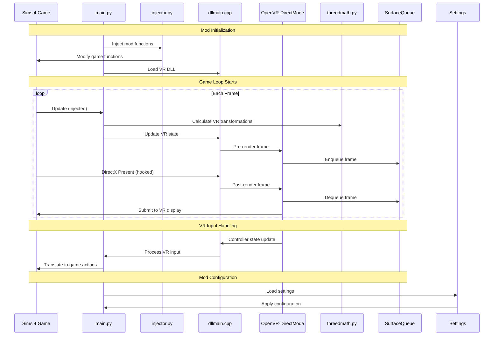

# Sims 4 VR Mod Analysis Compilation

## Table of Contents

1. [main.py Analysis](#mainpy-analysis)
2. [dllmain.cpp Analysis](#dllmaincpp-analysis)
3. [injector.py Analysis](#injectorpy-analysis)
4. [threedmath.py Analysis](#threedmathpy-analysis)
5. [OpenVR-DirectMode.cpp Analysis](#openvr-directmodecpp-analysis)
6. [compile.py Analysis](#compilepy-analysis)
7. [settings.py Analysis](#settingspy-analysis)
8. [OpenVR-DirectMode.h Analysis](#openvr-directmodeh-analysis)
9. [SurfaceQueue.h Analysis](#surfacequeueh-analysis)
10. [Sims 4 VR Mod Sequence Diagram](#sims-4-vr-mod-sequence-diagram)
11. [Open Questions](#open-questions)
12. [Next Steps](#next-steps)
13. [Important Considerations](#important-considerations)

# Sims 4 VR Mod File Analysis Summaries

## main.py Analysis

The central Python script for the Sims 4 VR mod. It handles VR integration, input processing, and interaction with the game's camera system. Key components include VR initialization, memory manipulation for game patching, input handling for VR controllers, and camera manipulation. It uses a custom DLL for VR functionality and injects code into the game's update loop.

## dllmain.cpp Analysis

The main entry point for the VR DLL. It sets up DirectX function hooks, initializes OpenVR, and manages the interface between the game and VR system. Key functions include handling pre- and post-frame rendering tasks, VR device tracking, and input processing. It uses a surface queue system for managing rendering between DirectX 9 and 11.

## injector.py Analysis

Provides utility functions for injecting new functionality into existing game functions. It includes an `inject` function for wrapping target functions, an `inject_to` decorator for easy method injection, and an `is_injectable` function to check compatibility. This module is crucial for modifying game behavior without altering original files.

## threedmath.py Analysis

Contains mathematical functions and classes for 3D operations in VR. It includes implementations for vector operations, matrix manipulations, and coordinate system conversions. Key functions handle rotation conversions between Euler angles, quaternions, and matrices, which are essential for VR camera and object transformations.

## OpenVR-DirectMode.cpp Analysis

Implements the `OpenVRDirectMode` class, which serves as the main interface between the game, DirectX, and OpenVR. It handles VR initialization, rendering pipeline modifications, device management, and frame submission to the VR compositor. The file demonstrates the complexity of integrating VR into a non-VR game engine.

## compile.py Analysis

A script responsible for compiling the Sims 4 VR mod and preparing it for deployment. It uses custom compilation functions, copies necessary DLL files, and executes additional scripts for package synchronization and build bundling. The script is crucial for the mod's build process but has basic error handling.

## settings.py Analysis

Serves as the central configuration file for the project. It defines various settings and paths used throughout the mod, including user-configurable options, project structure settings, and debug configurations. The file plays a key role in maintaining consistency across the project and allowing for easy customization.

## OpenVR-DirectMode.h Analysis

The header file for the `OpenVRDirectMode` class. It declares the necessary structures and functions for handling VR rendering and device interaction. Key components include methods for VR initialization, frame preparation and submission, view parameter retrieval, and controller state management. It bridges the gap between the game's DirectX 9 rendering and VR requirements.

## SurfaceQueue.h Analysis

Defines interfaces and structures for a surface queue system, crucial for managing rendering surfaces between different DirectX versions. It includes definitions for surface queue descriptors, producer and consumer interfaces, and a main surface queue interface. This system is likely key to efficient frame management in the VR rendering pipeline.

## Sims 4 VR Mod Sequence Diagram

## Open Questions

1. How does the mod handle performance optimization for VR rendering?
2. What is the exact process of intercepting and modifying the game's rendering pipeline?
3. How does the mod handle input from VR controllers and translate it to in-game actions?
4. What are the limitations of the current implementation, especially regarding game updates?
5. How does the surface queue system perform in practice, and are there any bottlenecks?
6. What is the full extent of the Python-C++ interaction in the mod?
7. How does the mod handle different VR headsets and their specific requirements?

## Next Steps

1. Analyze the implementation of `OpenVR-DirectMode.cpp` to understand the VR rendering process in detail.
2. Explore `sync_packages.py` and `bundle_build.py` to understand the full build and packaging process.
3. Investigate the Python scripts in the `Utility` folder, especially `helpers_compile.py`.
4. Examine `vrdll/Matrices.cpp` and `vrdll/Vectors.h` for more insight into the 3D math operations.
5. Look into `vrdll/python_exports.h` to understand the interface between Python and C++.

## Files to Analyze Next (from file-structure.md)

1. `/src/sims4-vr/src/ctypes/util.py`: Likely contains utility functions for C type handling.
2. `/src/sims4-vr/src/pyautogui/_pyautogui_win.py`: May provide insights into how the mod interacts with the Windows GUI.
3. `/src/sims4-vr/src/ReadWriteMemory/__init__.py`: Could reveal how the mod reads and writes game memory.
4. `/src/vrdll/vrdll/Matrices.cpp`: Probably contains important 3D math operations for VR.
5. `/src/vrdll/vrdll/python_exports.h`: Likely defines the interface between the C++ and Python parts of the mod.

## Important Considerations

1. **Performance**: VR requires high frame rates. Any modifications should carefully consider performance impacts.
2. **Compatibility**: The mod needs to maintain compatibility with different versions of The Sims 4 and various VR headsets.
3. **User Experience**: Ensure that VR interactions feel natural and don't induce motion sickness.
4. **Error Handling**: Robust error handling is crucial, especially when dealing with memory manipulation and hardware interfaces.
5. **Documentation**: Improve inline documentation to make the codebase more maintainable and accessible to other contributors.
6. **Testing**: Implement comprehensive testing, especially for the interaction between Python and C++ components.
7. **Modularity**: Consider ways to make the mod more modular, allowing for easier updates and feature additions.

